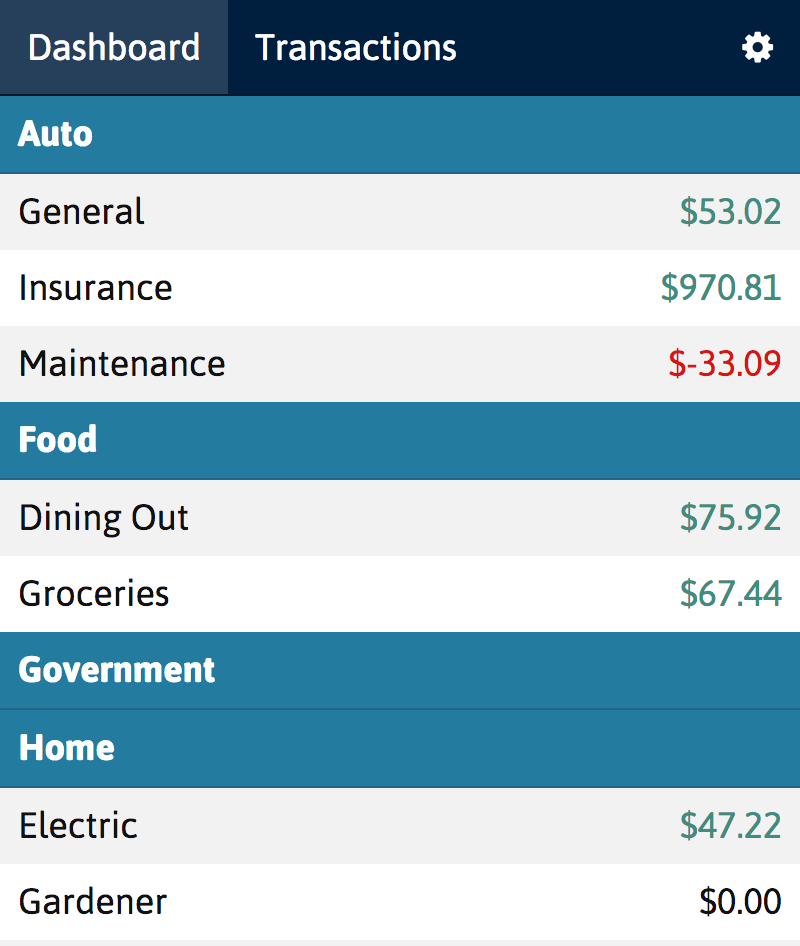
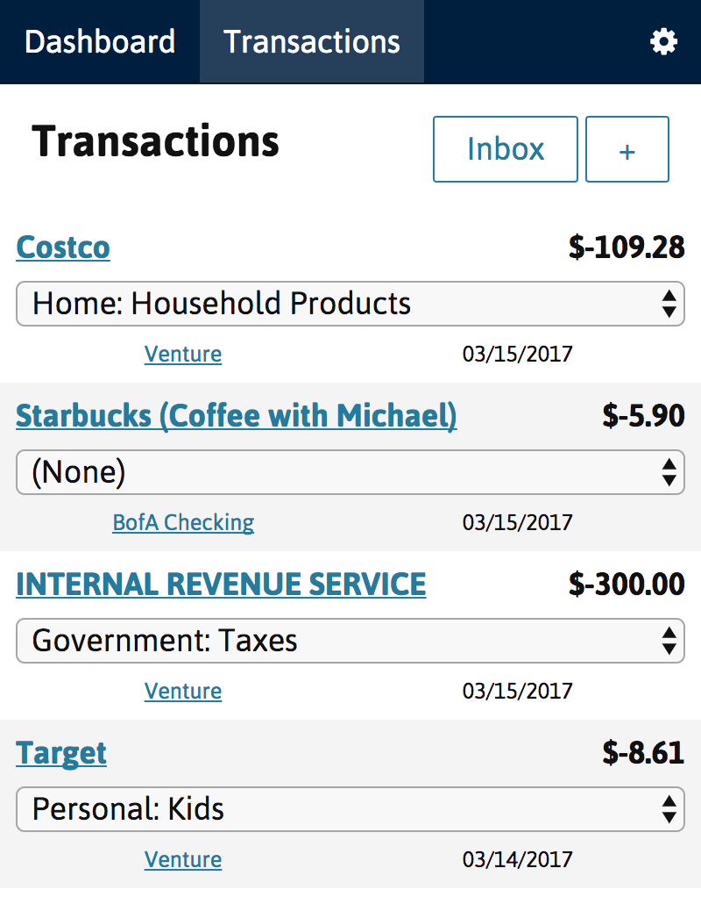
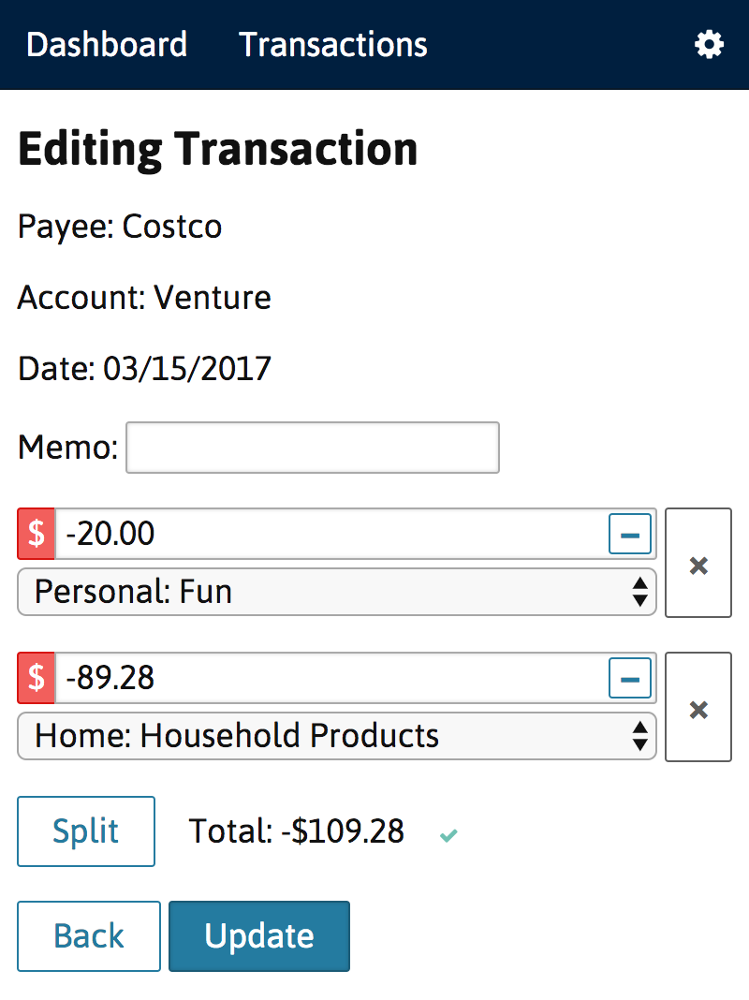

# Veelope

A super simple envelope budgeting tool built using Ruby on Rails + the Plaid API.

It's designed to be self-hosted, and stay out of your way. It uses [Plaid's transactions product](https://plaid.com/products/transactions/) to synchronize with your bank for maximum convenience.

Hit me up on Twitter [@personunsure](https://twitter.com/personunsure) or in the issues if you need any help.

## Screenshots

Main screen

Transaction list

Transaction editor

## Contributing

Pull requests and issues welcome!
